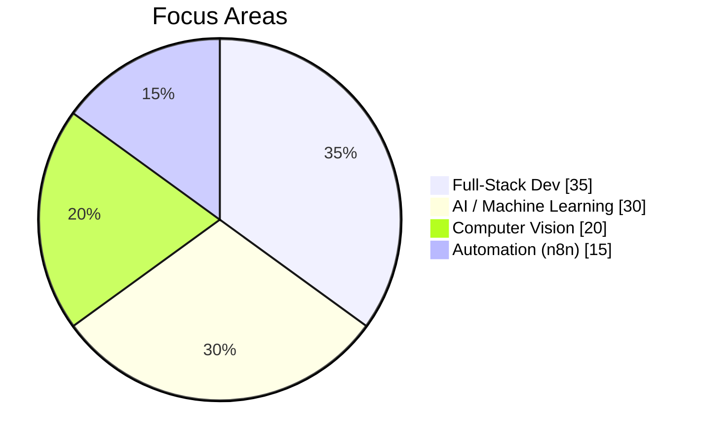

<p align="center">
  
</p>

<p align="center">
  
  
</p>

<p align="center">
  <a href="https://www.linkedin.com/in/YOUR-LINKEDIN-HANDLE"></a>
  <a href="mailto:tahasaadat680@gmail.com"></a>
  <a href="https://github.com/tahasaadat680"></a>
</p>

---

### 🚀 About Me

- 🎓 BS Computer Science student at **NUCES-FAST**, Chiniot-Faisalabad Campus (2022 – 2026)
- 🏆 Dean's List (Fall 2024) · GPA 3.5
- 💻 Full-stack + AI/ML developer — I like building things that actually solve a problem, from agricultural platforms to computer vision models
- 🌱 Currently exploring deeper computer vision & generative AI techniques
- 📫 Reach me at **tahasaadat680@gmail.com**

---

### 🛠️ Tech Stack

<p align="center">
  
</p>

<p align="center">
  
  
  
  
  
</p>

---

### 🐍 Contribution Snake

<p align="center">
  
</p>

> Generated automatically by a GitHub Action — setup steps are at the bottom of this file.

---

### 📊 GitHub Stats

<p align="center">
  
  
</p>

<p align="center">
  
</p>

<p align="center">
  
</p>

<p align="center">
  
</p>

<p align="center">
  
</p>

<div align="center">



</div>

---

### 📈 Contribution Activity (last 12 months)

<p align="center">
  
</p>

---

### 🔥 Featured Projects

<table>
  <tr>
    <td width="50%">
      <h4>🌾 AgriFusion — Agricultural Intermediary Platform</h4>
      <p><i>React · Next.js · Supabase · Hugging Face API · Tailwind</i></p>
      <p>Multi-stakeholder platform with a 5-table schema, 8 JWT-authenticated REST APIs, and AI-driven soil analysis with real-time dashboards.</p>
    </td>
    <td width="50%">
      <h4>🤖 Client Onboarding Automation System</h4>
      <p><i>n8n · Gemini AI · React · Next.js · MongoDB · Gmail API</i></p>
      <p>Full-stack onboarding pipeline with automated Gemini-powered email sequences and an admin dashboard wired to n8n.</p>
    </td>
  </tr>
  <tr>
    <td width="50%">
      <h4>🍅 Tomato Leaf Disease Detection (CV)</h4>
      <p><i>PyTorch · ConvNeXtV2 · Hugging Face · Gradio</i></p>
      <p>Deep learning classifier for 11 tomato disease classes using LDAM-Focal Loss on imbalanced data, deployed with a live Gradio demo.</p>
    </td>
    <td width="50%">
      <h4>🧠 Self-Supervised Image Representation Learning (MAE)</h4>
      <p><i>PyTorch · ViT · TinyImageNet</i></p>
      <p>Masked Autoencoder with asymmetric ViT-Base encoder / ViT-Small decoder, mixed precision, dual-GPU training, evaluated via PSNR/SSIM.</p>
    </td>
  </tr>
  <tr>
    <td width="50%">
      <h4>📋 Complaint Management System</h4>
      <p><i>Django · Python · SQLite · Bootstrap · Chart.js</i></p>
      <p>Complaint submission with file uploads, tracking, and an analytics dashboard for status/priority.</p>
    </td>
    <td width="50%">
      <h4>🏥 Hospital Management System</h4>
      <p><i>C# · Oracle Database</i></p>
      <p>Role-based system (Admin/Doctor/Patient) with appointment scheduling, prescriptions, and PDF report generation.</p>
    </td>
  </tr>
</table>

---

### 💪 Skill Proficiency

<p align="center">
  <br/>
  <br/>
  <br/>
  <br/>
  
</p>

---

<p align="center">
  
</p>

<p align="center"><i>⭐️ From <a href="https://github.com/tahasaadat680">Taha Saadat</a></i></p>


---

<details>
<summary>⚙️ How to enable the snake contribution animation (one-time setup)</summary>

1. In your profile repo (`tahasaadat680/tahasaadat680`), create the folder `.github/workflows/`.
2. Add a file `snake.yml` with:

```yaml
name: Generate Snake
on:
  schedule:
    - cron: "0 */6 * * *"
  workflow_dispatch: {}
  push:
    branches: [ main ]

jobs:
  generate:
    runs-on: ubuntu-latest
    permissions:
      contents: write
    steps:
      - uses: Platane/snk@v3
        with:
          github_user_name: tahasaadat680
          outputs: |
            dist/github-contribution-grid-snake-dark.svg?palette=github-dark
            dist/github-contribution-grid-snake.svg
      - uses: crazy-max/ghaction-github-pages@v4
        with:
          target_branch: output
          build_dir: dist
        env:
          GITHUB_TOKEN: ${{ '{{' }} secrets.GITHUB_TOKEN {{ '}}' }}
```

3. Commit it, then run the workflow once manually (Actions tab → Generate Snake → Run workflow).
4. It creates an `output` branch with the SVG — the image tag earlier in this README already points to it.

</details>
